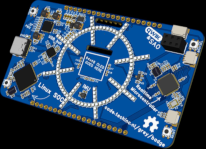
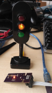
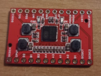

# Matthew Baggett

Developer, Electronics Design Enthusiast, Terraform Evangelist, Docker Preacher and Automation-ist 
currently residing in Almere, Netherlands. 
Previously, I've lived in Maastricht in the Netherlands, and Manchester, Sheffield and Leicester, England. 
I'm originally from Oxford, England.

The latest version of my CV in PDF format is [always available here](https://matthewbaggett.github.io/Matthew_Baggett_CV.pdf).

| Contact by:               | &nbsp;                                                            |
|---------------------------|-------------------------------------------------------------------|
| Contracting Company Site: | [Grey.ooo](https://grey.ooo)                                      |
| Telephone & Whatsapp:     | +31 (0) 621 34 82 45                                              |
| LinkedIn:                 | [LinkedIn](https://www.linkedin.com/in/matthewbaggett-was-taken)  |
| Email:                    | [matthew@baggett.me](mailto:matthew@baggett.me)                   |
| Github Accounts:          | [Personal Github](https://github.com/matthewbaggett)              |
| &nbsp;                    | [Benzine Framework](https://github.com/benzine-framework) **WIP** |

# Abilities & Technologies:

* Build-out of highly available, automatically scaling dockerised cluster infrastructure using Docker Swarm.
* Conversion of existing infrastructure and legacy applications into scalable, fault-tolerant dockerised solutions.
* Expert at reducing TCO of customer cloud systems.
* 17 years experience of PHP (been at it since 2008!).
* Infrastructure-as-code Terraform evangelist. 
  * I have a large repo of [Opinionated Terraform Modules](https://github.com/matthewbaggett/terraform_modules) that let me build out scalable infrastructure in minutes.
* Experienced with modern PHP. Excited for PHP8.4 to go to production.
* Slim 4, Drupal 7, Laravel & Zend (Now Lamina) Framework 2
* Vast experience building dockerised systems 
  * Check out [Benzine/Docker](https://github.com/benzine-framework/docker) ! It’s a Dockerised baseimage for PHP+Nginx / PHP+Apache / CLI with multiple executed threads using runit and onbuild steps to make building a docker image of an app as simple as FROM benzine/php:nginx!
* Experienced with architecting and building out scalable Microservices with AWS Auto Scaling
* Unit Testing with PHPUnit & Integration Testing with Selenium.
* Code Quality improvement and maintenance through PHPStan, Code Style enforcement through PHP-CS-Fixer. 
* Extensive experience with dockerization of scalable services.
* Build massively parallelized ETL pipelines for large data ingress.
* Build Automation and Deployment Management with [Github Actions](https://github.com/goneio/base-image/blob/master/.github/workflows/build.yml), Jenkins, Gitlab-CI & Travis.
* AWS RDS Serverless, AWS Aurora, MariaDB, MySQL and MS SQL database backends, design of database schemas upon them
* Experienced with Redis & MQTT as cache and message brokers
* NodeJS & Socket.io
* Javascript with and without the jQuery library, as well as implementation of AJAX features.
* HTML 4/5 & CSS 2/3 templating from designer-provided designs
* Amazon AWS cloud systems (EC2, Auto Scaling Groups, Elastic Search, Elastic Load Balancer, Route 53, RDS, Elasticache, SES)
* Usage of CMS (Content Management Systems) such as Drupal, WordPress and other proprietary systems (Contented, custom builds)
* Previous custom module creation for Drupal, some of which open sourced
* Use of 3rd party systems and APIs, REST, etc.
* W3C standards compliance for the web
* Knowledge of Traefik, Nginx & Apache
* Working in a team on large projects with source control such as Git & Subversion

# Recent Open Source contributions:
## Software
* [Opinionated Terraform Modules](https://github.com/matthewbaggett/terraform_modules) - A large collection of opinionated Terraform modules that mostly lego-brick their way together using traefik and a few choice design decisions. Not everything in here is fully fleshed out, but most of it is in use somewhere.
* [S3DB](https://github.com/benzine-framework/s3db) - A S3-backed ephemeral database built ontop of postgres or mysql. Intended for use in short-lived and non-mission-critical QA environments.
* [Benzine Framework](https://github.com/benzine-framework) - All of the components I build and reuse live under this psuedo-organisation/brand.
* [Docker Base Images](https://github.com/benzine-framework#docker-images) - A set of well-built, multi-process PHP and NodeJS images using runit for service startup
* [GitHub Actions](https://github.com/benzine-framework#actions) - A set of Github Actions that I use to build and deploy my projects.
 
## Hardware

* [TechInc Badge](https://code.techinc.nl/grey/badge) - A badge for the TechInc hackerspace in Amsterdam. It is a work in progress but recently had its first prototype run of the front display assembly. It features a 70x40 pixel mono OLED display, a few buttons, an accelerometer and a USB C charge port. Driving it is a f1c200s linux SoC and a RP2040 microcontroller, plus power + battery management.
* [Tamagotchya](https://matthewbaggett.github.io/Tamagotchya) - A **WIP** 2019 Tamagotchi Clone featuring Wifi, Bluetooth and a 128x64 pixel oLED display, 5 way D pad and an accelerometer and a USB C charge port.

* [Traffic Light](https://matthewbaggett.github.io/Traffic-Light/) - I saw a small, cheap traffic light toy in Spain. I figured it'd make a fun desk ornament. And then I realised it'd juuuust fit an ESP8266 module inside it. Pictured is one of the two traffic lights with the circuitry fitted, a spare infront of it with the programming header still attached for illustration. Click the picture to see a short video clip of it cycling. It runs Tasmota under the hood and is plugged into Home-Assistant. At the time, it signalled system 'health' as an on-desk chotchky for monitoring systems.
* [Hexagon LEDs](https://matthewbaggett.github.io/Hexagon-LED) - Build a small, inexpensive hexagonal lighting PCB with an inexpensive microcontroller that can communicate using slow-speed software serial with the other attached nodes and to an optionally fitted ESP8266 ESP-01 module which will designate itself the "host", and populate out colour information from the center. This project was scuppered by the 2020-2022 chip crisis.

* AXP2101 Breakout - The [AXP2101](https://jlcpcb.com/partdetail/X_PowersTech-AXP2101/C3036461) is a really neat PMIC (Power Management Integrated Circuit) found in a lot of low-end laptops, smartphones etc. It has an interesting featureset, but its minimal circuit is relatively complicated, and requires reflowing a hard-to-hand-assemble (but not impossible) QFN40 package, so I designed a breakout for it to make it hobby-accessible. It has a lot of features like battery management/protection, current metering, e-gauge (where it meters the columbs of energy inserted/removed from the lithium cell) and dynamically programmable voltage rails: 4 high-efficiency high-power buck converters, and 11 LDOs. It also has some other trick features like a hardware watchdog and soft-touch power on/off features for your product.

# Employment History
## August - Present: Freelance Devops & Software Engineer for various entities
* Varied infrastructure and development work.

## March 2023 - August: Devops & Backend Engineer at One Up Sales / Stormburst Studios
* Buildout of a highly parallelised data ingest pipeline
* Partial buildout of multi-tiered, multi-tenant datastore
* Implement GitHub Actions CI/CD pipeline and related self-host infrastructure
* Implement Terraform infrastructure for Production & QA environments
* Strive for improvements to development practices.
* Deploy bare-metal infrastructure at a fraction of the cost of cloud providers with the same level of redundancy and availability.
* Multi-provider cloud infrastructure built for availability and redundency within cost constraints.

## August 2021 - March 2023: Devops & Infrastructure at SuperScript.
* Planning infrastructure & implementation of migration away from Heroku and AWS to self-managed private cloud
* Implement wide-spanning deployment automation and quality control.
* QA environments transferred from home-made node-driven CI/CD pipeline to Github Actions and Terraform with QA environments spun up on-demand by commits pushed to branches.
* Refactoring of existing home-grown node-driven CI/CD pipeline.
* Deployment of dozens of varied AWS assets to support the needs of the business.
* Architecting scalable POC for other departments to support the running of a hetrogenous ecosystem of containers in various languages and platforms.
* Primary port of call for business-focused persons to consult regarding cloud services.

## Dec 2021 - March 2022: Consultancy for Vice Media
* Support existing platform application and picked up where the previous developer left off.
* Dockerise local development.
* Improve production container quality.
* Ticket bustin' for their Laravel+Vue app.

## January 2021 - August 2021: Backend Developer at ADPI B.V
* Started to introduce Terraform & porting application to docker running on AWS services.
* Feature development ontop of existing legacy product.
* Refactored large portions of their extant Laravel application, chiefly around a highly customised mail process.
* Introduction of Unit Testing to product.
* Introduction of CI/CD pipeline using Github Actions.
* Brought in basic disaster recovery.

## September 2019 - January 2021: Senior PHP Developer at Kiesproduct B.V.
* Buildout of highly scalable data ingest pipeline to digest data from thousands of feeds in diverse formats.
* Buildout of new platform, greenfield build on PHP7.4, Slim Router, Elastic Search, RDS Serverless, parallelised process workers.
* Buildout of brand new multi-cloud architecture, using best-practice infrastructure-as-code tools, highly available, highly scalable clusters of small worker machines to achieve multi-region failure-tolerance.
* Transitioned company to using better (aiming for best) practices, including migration to Git, automated build pipelines, security and access controls, code quality review (automated, and manual).

## Feb 2019 - September 2019: Senior PHP Developer at TradeTracker Netherlands
* Maintenance of existing codebase.
* Build microservices to implement new functionality for existing applications.
* Helped to bring forward a test-welcome approach, driving forward automated pipelines with Gitlab, PHPUnit, Docker.
* Building new functionality to meet business requirements.
* Helping migrate legacy code to remain on a supported platform.

## March 2016 - Jan 2019: Contract, then Permanent Senior PHP Developer, Docker Devops at Segura Systems LTD
* Architected & built-out a new Microservices-based, Dockerised system to move a legacy product forward, to migrate the existing product away from a legacy PHP 5.6 codebase into a modern PHP 7.3 application.
* Using Slim 3, Composer, ZF2 DB, Monolog plugged into Rollbar, PHPUnit.
* Packaged reusable assets into an open-sourced common core library that depended upon upstream technologies (Forked at https://github.com/matthewbaggett/AppCore).
* Built custom tooling to generate consistent CRUD Controllers, Models, Table Gateways and Tests.
* Implemented Unit Testing as a plan across the team for future projects
* Implemented Selenium tooling for testing existing application
* Implemented Continuous Integration (CI) with proposed (and enableable) Continuous Deployment (CD) using Jenkins

## 4th December 2015 - March 2016: Contract Developer At Liverpool FC:
* Adding features to an existing large media project for a large sporting entity
* Developing solutions to problems specified.
* Testing features with Behat & Selenium.

## 4th September 2015 - December 2015: Contract Project Architect (Inprime Logistics/Birdsystem)
* Build out new Zend Framework 2 project skeleton to be completed by in-house developers
* Model new system’s API endpoints to match existing system closely
* Generate structures and models based on existing production database, as well as implementing controllers, PHPUnit tests, ZF2 DB’s tablegateway structures.

## 4th June 2015 - 4th September 2015: Contract DevOps & Testing Infrastructure Consultant at Frontline Solutions (Frontline-Solutions.co.uk)
* Create automated test & code quality infrastructure using Jenkins.
* Create automated deployment infrastructure using Docker and Tutum.
* Writing Unit Tests for existing codebase.
* Write & Implement test policy for future development.

## April 2015 - June 2015: Contract PHP/Drupal Developer at Savvy Creative, Nottingham
* Bespoke application to handle financial distribution of money from investment assets
* Laravel 4.2, PHPUnit, PHPOffice/PHPExcel Import/Export functionality
* Generate automated statements for print & customer online access

## 13th May 2013 - 27th February 2015: Contract PHP/Drupal Developer at BT Engage IT
* Main developer on a massive hosting platform interface that manages thousands of virtual machines over hundreds of servers
* Implementing a PHPUnit & Selenium test infrastructure
* Implemented containerisation of application using Docker
* Integrated Realtime feedback to UI as systems deployed through the portal application using NodeJS and Socket.io
* Drupal-backend frontend, hooked into a Slim Framework PHP-driven API that hooks up with a central management database backed by MSSQL
* System state reporting, presentation and management of automated issues and faults
* Integration with Remedy ITSM 
* Automated deployment of the developed application to prod/uat/qa/dev systems

## 25th Feb 2013 - 10th May 2013: Contract PHP Developer at Informed Solutions
* Lead Developer for a new Drupal-backed survey portal for the UK Cabinet Office’s Electoral Registration Transformation Programme
* Maintenance and renovation work to Local Government Boundary Commission for England (LGBCE)
* Many custom modules built, to provide bespoke functionality in both cases
* Built atop of Amazon Web Services, utilising EC2, Elastic Load Balancing, RDS & SES
* Assisted in Migration to GitHub away from Visual Source Safe. Built automatic-deployment for development servers.

## June 2012 - 22nd February 2013: Contract PHP developer at eziConex/Factotum
* Bespoke Drupal 7 application development
* Integration with Social networks 
* Building out a Web Publishing & Ecommerce platform
* Extending existing Drupal modules, creating bespoke modules, integrating with node.js
* Integration with Amazon AWS, using EC2, RDS, ElastiCache, Route 53, Enom for Domains, Paypal for Payment
* Creating mini-sites for customers programmatically, purchasing domain, handling payment from PayPal, setting up the DNS entries as appropriate for domain with Amazon Route 53, creating site structure on server, allowing user to select a template from presets, allowing user to input their content inline into their site.

## February 2012 - May 2012: Contract PHP developer at VoucherCloud / Invitation Digital, Bristol
* Maintenance and improvement work on existing codebase
* New style revamp of site section (HTML/CSS/jQuery/Photoshop)

## 6th December 2011 - January 2012: Contract PHP/Wordpress dev at Informed Solutions
* Wordpress hacking & templating to rapidly prototype an information/geodata storage/retrieval system for Cartography

## 12th May 2011 - 24th November 2011: PHP web developer, Docnet, Manchester
* Zend-Based E-Commerce systems and websites, mostly in the fashion industry
* Frontend maintenance/feature building
* Backend issue fixing, Building new reports to customers requirements
* PHP5, MySQL

## 4th January 2011 - 30th April 2011: PHP web developer, Motortrak, London
* Legacy websites, older custom CMS sites built on Oracle database.
* Maintenance of car dealership websites, sites for manufacturers.
* Bug fixing and new feature development for clients.
* PHP4/5, Oracle, 3rd party services and feeds.

## Aug 2010 - 4th January 2011:	Short-term Web Developer, Webcurl, Oxford
* Drupal PHP5 Content Management System/Framework website development, 
* Custom module development
* Site Translation
* Legacy stock trading platform maintenance and upgrade
* AJAX functionality integration, or similar using JSON
* Completed projects using PHP5 OOP, MySQL, MS SQL, jQuery, AJAX along with XHTML/CSS front-end work
* XSLT template work
* Similar responsibilities to prior employment at White October

## Feb 2010 - June 2010: Junior Web developer, I-COM, Manchester
* Building sites based on existing CMS system
* Housekeeping
* Used PHP, MySQL, jQuery & Smartie templating engine to complete mostly frontend development
* Similar responsibilities to prior employment at White October

## Dec 2008 - Jan 2010: Junior Web developer, White October LTD, Oxford
* PSD design cut up into good, valid (X)HTML, using Photoshop and the Eclipse IDE, that, while using complex construction (CSS3/Transparency) still displays in a usable way (if not perfectly) in legacy browsers.
* Developing sites in object-oriented PHP5, working with legacy PHP4 code
* Writing functionality in jQuery (Javascript library) for various projects
* Gluing sites together based on the in-house PHP5/XML/XSLT-based Content Management System
* Custom PHP-based sites, on occasion
* Custom PHP modules for CMS
* Wordpress blogs and skinning
* Making teas and coffees, washing up

## Summer 2008: Freelance Web Developer
* Employed by EquineTelemetry over the summer of '08 to construct a website to sell a cellular-based alarm system for tracking stolen heavy plant equipment from building sites in Australia.

# Other relevant projects & experiences:
## Contributed to The 24 Hour startup: 
While at White October, worked on starting a company in 24 hours from concept to business concept sale (complete with working code) inside of 24 hours.

# Other
Full Manual drivers licence
Dutch Verblijfstitel (Residence Permit)
